# Awesome-Cloud-Resource-Search-Discovery 🔎 ☁️

  

  
  
  
  
  
  

---

## 🌟 Top Cloud Resource Search & Discovery Ecosystem

**Curated List of Commercial Discovery Platforms & Open-Source Resource Inventory Tools**  
*Focused on Multi-Cloud Asset Inventory, Graph-Based Relationship Mapping, Query Languages for Cloud Resources & Self-Hosted Discovery Engines*

**Last updated: October 2026** 📅

---

### 📌 Overview & Market SEO Summary

Welcome to the definitive, SEO-optimized directory of **cloud resource search and discovery tools**, **open-source cloud asset inventory engines**, **cyber asset attack surface management (CAASM)**, and **graph-based infrastructure relationship mappers**. Modern enterprise IT environments span thousands of ephemeral accounts, regions, and microservices across AWS, Azure, GCP, and Kubernetes. Finding untagged assets, mapping hidden IAM blast radiuses, and executing zero-ETL SQL queries across infrastructure APIs are critical requirements for cloud engineers, DevOps teams, and FinOps / Security practitioners.

---

## 📑 Table of Contents
- [📈 Market Size & Dynamics](#-market-size--dynamics)
- [🏢 SaaS & Commercial Platforms](#-saas--commercial-platforms)
- [🔓 Open-Source GitHub Projects](#-open-source-github-projects)
- [🛠️ How to Contribute](#%EF%B8%8F-how-to-contribute)
- [📊 Star History](#-star-history)
- [🤝 Support & Sponsorship](#-support--sponsorship)
- [⚠️ Disclaimer](#%EF%B8%8F-disclaimer)

---

## 📈 Market Size & Dynamics

The Global Cloud Asset Management & Cyber Asset Attack Surface Management (CAASM) market is estimated at **$4.2 Billion in 2026**, growing at a CAGR of 28.5% towards $11.8 Billion by 2030. The sector is **moderately fragmented**: while hyperscaler native search utilities (AWS Resource Explorer, Azure Resource Graph) dominate basic cloud-native search, enterprise security and inventory management are contested between multi-cloud graph unicorns (Wiz, Orca, JupiterOne) and flexible open-source SQL data platforms (CloudQuery, Steampipe).

---

## 🏢 SaaS / Commercial Platforms

*Sorted by Valuation / Company Size (Descending)* 🏢

| SaaS / Commercial Platform | Company / Owner | Company Size (Valuation / Market Cap) | Standard Edition Starting Price | Free Tier / Free Trial Limits | Description |
| :--- | :--- | :--- | :--- | :--- | :--- |
| **[AWS Resource Explorer](https://aws.amazon.com/resource-explorer/)** ☁️ | Amazon | ~$2.0 Trillion | **$0.00/month** (Included with AWS account) | **Free forever** (Indexes metadata across regions at no additional charge; pay only for underlying AWS infrastructure) | **AWS-native resource search** — **Search and discover AWS resources** across regions and accounts. **Unified Search** supports natural language queries. **Indexes resource metadata** for fast retrieval. **Integrates with AWS Organizations** for multi-account visibility. |
| **[Wiz Cloud Discovery](https://www.wiz.io/)** 🟣 | Google (Acquired) / Alphabet | ~$10.0 Billion | **$24,000/year** (Essential tier covering up to 100 workloads) | **No free tier** (Includes a 14-day guided proof-of-concept / interactive sandbox demo) | **Agentless cloud security (CNAPP)** — **Security graph for code-to-cloud context**. **Agentless scanning** across AWS, Azure, and GCP without deployment. **Named Leader in Forrester Wave: Proactive Security Platforms, Q3 2026**. |
| **[Orca Security Cloud Inventory](https://orca.security/)** 🐋 | Orca Security | ~$1.8 Billion | **$15,000/year** (Starting package for up to 250 workloads) | **14-day free trial** (Full agentless SideScanning scan of 1 cloud account up to 500 workloads) | **Agentless-first CNAPP** — **SideScanning technology** reads cloud workload block storage out-of-band. **Unified platform** across cloud infrastructure, workloads, identities, applications, and **AI systems**. |
| **[JupiterOne](https://www.jupiterone.com/)** 🪐 | JupiterOne | ~$1.0 Billion | **$999/month** (Standard plan for up to 1,000 entities/managed assets) | **Free tier available** (Free forever for up to 100 asset entities & 3 integrations) | **Cyber asset attack surface management** — **Graph-based relationship mapping** of cloud resources, identities, and vulnerabilities. **Query language** for complex security questions. **Compliance automation** and **real-time alerts**. |
| **[Firefly Cloud Asset Management](https://firefly.ai/)** 🪰 | Firefly | ~$150 Million | **$500/month** (Starter tier for up to 250 unmanaged/managed cloud resources) | **14-day free trial** (Unrestricted scanning of up to 500 cloud resources across AWS/GCP/Azure) | **Infrastructure-as-code management** — **Scans metadata and configurations only**, not workload data. **SOC 2 Type II certified**, ISO 27001 and GDPR aligned. **No customer data used for AI model training**. |
| **[Turbot Guardrails](https://turbot.com/guardrails)** 🛡️ | Turbot | ~$100 Million | **$0.05/control/month** (SaaS model; Enterprise edition starting at $0.10/active control) | **14-day free trial** (Full SaaS feature access up to 100 active policy controls) | **Preventive Security Posture Management (PSPM)** — **Blocks risky changes before deployment**. **Resource discovery with metadata enrichment**. **Policy Simulator** tests against real CloudTrail data. |
| **[Resmo](https://www.resmo.com/)** 📋 | Resmo | ~$50 Million | **$199/month** (Team edition for up to 50 active users / SaaS integrations) | **Free tier available** (Free forever for up to 2 users and 5 cloud/SaaS integrations) | **Cloud asset inventory and security** — **Continuous discovery and change tracking** across SaaS and cloud. **SQL-based querying** of asset inventory. |
| **[OpsCompass](https://opscompass.com/)** 🧭 | OpsCompass | ~$30 Million | **$500/month** (Standard tier covering up to 500 cloud resource items) | **30-day free trial** (Full discovery & drift detection for up to 2 cloud accounts) | **Cloud security posture management** — **Resource inventory with drift detection** across Azure, AWS, and GCP. |

---

## 🔓 Open-Source GitHub Projects

*Sorted by GitHub Stars Count (Descending)* 🌟

- **[Prowler](https://github.com/prowler-cloud/prowler)**  🛡️  
  **Comprehensive cloud security assessment and asset discovery tool**, Apache-2.0 licensed. **Over 11,500+ stars**. **553 checks for AWS, 138 for Azure, 77 for GCP, 83 for Kubernetes** covering CIS, NIST, PCI-DSS, GDPR, HIPAA, SOC2. **Resource discovery and compliance assessment** in one tool. Includes **Prowler App** dashboard and **OCSF v1.1.0 JSON** export.

- **[Cloud Custodian](https://github.com/cloud-custodian/cloud-custodian)**  🛡️  
  **Rules engine for cloud resource search, cost optimization, and governance**, Apache-2.0 licensed. **Over 5,800+ stars**. **YAML-based policies for AWS, Azure, GCP** — query and manage resources without writing code. **Automated remediation**: tag enforcement, idle resource cleanup, rightsizing, and compliance auditing.

- **[CloudQuery](https://github.com/cloudquery/cloudquery)**  📦  
  **High-performance cloud asset inventory ELT framework**, MPL-2.0 licensed. **Extracts multi-cloud configuration into PostgreSQL, Snowflake, or BigQuery** for querying and analysis. **Custom SQL queries** for compliance, cost, and security analysis. **Scalable asset inventory engine** designed for multi-cloud enterprise environments.

- **[Steampipe](https://github.com/turbot/steampipe)**  🔗  
  **Query cloud APIs directly with SQL**, AGPL-3.0 licensed. **Over 7,000+ stars**. **Zero-ETL approach** — query AWS, Azure, GCP, Kubernetes, and **100+ services directly**. **No database required** — translates SQL queries to API calls on the fly. Ideal for quick ad-hoc resource discovery and compliance checks.

- **[Cartography](https://github.com/lyft/cartography)**  🗺️  
  **Infrastructure asset and relationship graph mapping**, Apache-2.0 licensed. **Consolidates infrastructure assets and dependencies in Neo4j**. **Supports AWS, Azure, GCP, Kubernetes, Okta, and 30+ services**. **Exposes hidden access paths and dependency relationships** to uncover attack surface risks. Battle-tested at Lyft.

- **[Komiser](https://github.com/tailwarden/komiser)**  🔍  
  **Cloud resource inventory visibility and cost optimization dashboard**, Apache-2.0 licensed. **Over 4,800+ stars**. **Multi-cloud single pane of glass** for AWS, Azure, GCP, DigitalOcean, OCI, and Kubernetes. Detects idle resources, unattached disks, untagged assets, and cost drivers.

- **[ScoutSuite](https://github.com/nccgroup/ScoutSuite)**  🔍  
  **Multi-cloud security auditing and asset inventory tool**, GPL-2.0 licensed. **Over 3,800+ stars**. **Collects configuration data from cloud provider APIs** and generates clear security posture reports. Automatically flags open S3 buckets, overly permissive IAM policies, and exposed security groups.

- **[Cloudlist](https://github.com/projectdiscovery/cloudlist)**  📋  
  **Multi-cloud asset listing utility**, MIT licensed. **Over 2,100+ stars**. **Fast CLI tool that enumerates assets across AWS, GCP, Azure, DigitalOcean, and Cloudflare**. Part of the ProjectDiscovery ecosystem — seamlessly pairs with Nuclei and Subfinder for attack surface discovery.

- **[CloudFox](https://github.com/BishopFox/cloudfox)**  🦊  
  **AWS cloud situational awareness and resource enumeration tool**, Apache-2.0 licensed. **Over 1,600+ stars**. Automates discovery of attack vectors, S3 buckets, privilege escalation paths, EKS clusters, and IAM policy permissions during penetration testing and audits.

- **[ElectricEye](https://github.com/Cloud-Red-Team/ElectricEye)**  🔭  
  **Multi-cloud continuous asset discovery & posture management CLI**, Apache-2.0 licensed. **Over 960+ stars**. Python CLI for asset inventory, security posture management, and attack surface monitoring across AWS, Azure, GCP, and SaaS APIs.

- **[Resoto (Fix Inventory)](https://github.com/someengineering/resoto)**  ⚙️  
  **Open-source cloud infrastructure inventory graph engine**, Apache-2.0 licensed. **Over 650+ stars**. Automatically indexes resources across multi-cloud environments into a unified property graph, allowing engineers to query, clean up, and secure cloud footprint.

- **[AWS Nuke](https://github.com/ekristen/aws-nuke)**  💥  
  **AWS resource discovery and account cleanup tool**, MIT licensed. **Over 500+ stars**. Scans and deletes all resources in an AWS account, indispensable for sandbox account resetting and automated resource discovery.

---

## 🛠️ How to Contribute

Contributions are welcome! Follow these steps to submit new resource discovery platforms or open-source inventory software:

1. 🍴 **Fork** the repository.
2. 📝 **Add/edit** entries in `README.md` maintaining table/list structure and formatting.
3. 🔗 Include project title, official website/GitHub link, exact star count badge, license, and brief description.
4. 🚀 Submit a **Pull Request** with a descriptive summary of your changes.

---

## 📊 Star History

---

## 🤝 Support & Sponsorship

If you find this cloud resource search and discovery repository useful, please consider supporting the project:

- ⭐ **Star** this repository to increase visibility!
- 🔀 **Fork** and share with fellow cloud engineers, security teams, and open-source advocates.
- ☕ **Sponsor & Buy Me a Coffee**: Support ongoing open-source curation via the [GitHub Sponsor Dashboard](https://github.com/sponsors/ishandutta2007).

---

## ⚠️ Disclaimer

- This is a **community-curated** list — not exhaustive and not an endorsement. ℹ️
- **AWS Resource Explorer is free** — you pay only for underlying resources. **Unified Search supports natural language queries** across regions and accounts.
- **CloudQuery and Steampipe take fundamentally different approaches**: **CloudQuery extracts configuration into PostgreSQL** for persistent querying and analysis, while **Steampipe queries APIs directly with zero-ETL** — no data storage, just SQL translated to API calls. **Choose based on whether you need historical data (CloudQuery) or real-time snapshots (Steampipe)**.
- **Cartography requires Neo4j** and is designed for **graph-based relationship analysis** — not flat inventory. **It exposes hidden dependencies** that flat inventories miss but requires **Python and Neo4j expertise** to operate.
- **Open-source tools (CloudQuery, Steampipe, Cartography, Komiser, Prowler) are not turnkey** — they require **deployment, configuration, and ongoing maintenance**. **Always validate discovery results with a proof-of-concept** before relying on them for security or compliance decisions. 🔎

---

  <b>Made with ❤️ for cloud engineers, security teams, and open-source discovery advocates.</b>

